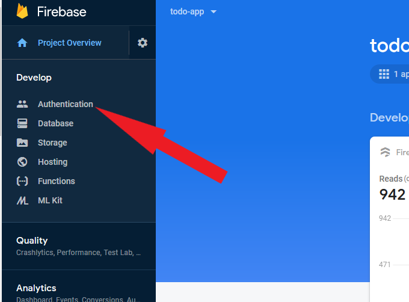

# Firebase Authentication

Et af formålene med authentication, er at bestemme hvilke brugere der har adgang til at hente, ændre, indsætte eller slette bestemte data.

Måske skal alle have læse rettigheder til noget data, mens andet data kun må kunne tilgåes hvis man er logget ind, og måske skal man kun have lov til at oprette et document hvis man har en særlig rettighed.

Der er mange scenarier, og mange metoder og tilgange til authentication. Vi kommer igennem nogle ret grundlæggende funktioner.

## Aktiver Autentication
Det første der skal ske, er at Authentication aktiveres på projektet.

Det sker via firebase consollen.



Derefter skal vi beslutte hvilke metoder det skal være muligt at benytte, for at kunne logge på systemet.
Vi fokuserer udelukkene på **email and password** ind til videre.


## Opret en bruger
Når Authentication er sat til, kan vi manuelt oprette brugere som skal kunne logge på systemet.

Det er ganske enkelt at klikke på **Add user** og udfylde **email** og **password**

Kodeordet vil blive hashet, så det ikke kan læses efterfølgende, så husk hvad du skriver!.


## Knyt Auth til siden

For at få adgang til Authentication på ude i browseren, skal vi hente et nyt firebase modul, som indsættes i `<head>` efter **firebase-app.js** scriptet.
```html
<script src="https://www.gstatic.com/firebasejs/7.2.2/firebase-auth.js"></script>
```

Derudover skal vi have initialiseret auth funktionerne, det sker i det script-tag hvor firebase config og firestore køres i `index.html` dokumentet, her tilføjes auth kodeblokken:
```javascript
// Initialize Firebase
firebase.initializeApp(firebaseConfig);

// referer til authentication service 
const auth = firebase.auth();
```

Og da vi kommer til at arbejde med en del forskellige authentication funktioner,giver det mening at oprette en seperat script fil til dem, så opret en fil kaldet **auth.js** og tilføj den til din `index.html`, den er tom indtil videre.


## Login på siden

Nu hvor der er en bruger på systemet, så skal den bruger kunne logge ind på siden via en login formular.

Så opret en formular med et **brugernavn** og et **kodeord**, samt en button så formen kan sendes.

I `auth.js` filen, knyttes en eventlistner til submit på loginformen, så vi kan gribe data og sende til Authentication.

```javascript
const loginform = document.querySelector('#loginform');
loginform.addEventListener('submit', function (event) {
   event.preventDefault();
   
   document.querySelector('#loginform_error').textContent = '';

   const email = loginform.username.value;
   const password = loginform.password.value;

   // HUSK VALIDERING !!!

   auth.signInWithEmailAndPassword(email, password)
      .then(function (cred) {
         console.log(cred);
         loginform.reset(); // ryd loginformen
      })
      .catch(function (error) {
         document.querySelector('#loginform_error').textContent = error.message
      })
});
```

I det viste eksempel kalder vi auth funktionen `signInWithEmailAndPassword` som ganske enkelt kigger i Authentication brugerene efter en bruger med de medsendte oplysninger. 

`Catch` funktionen kan benyttes til at udskrive beskeder som serveren sender tilbage, så opret et sted ved din form, hvor det kan udskrives.

Prøv at taste noget forkert, og afprøv hvad der sker hvis f.eks. password ikke er sendt med, eller emailen ikke er en valid email.


Tjek konsollen når det lykkes at logge på med korrekte oplysninger... der får du en masse oplysninger om brugeren.