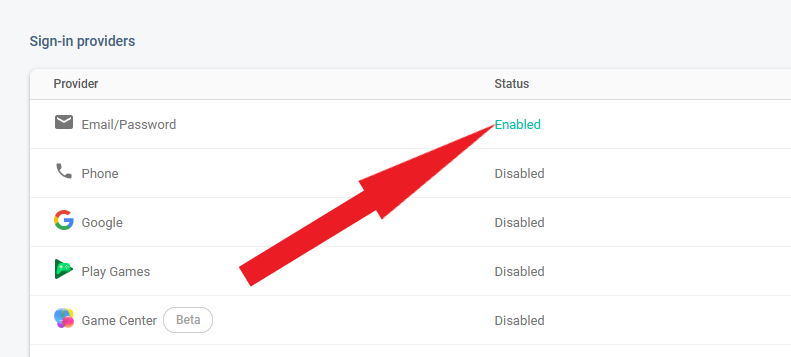
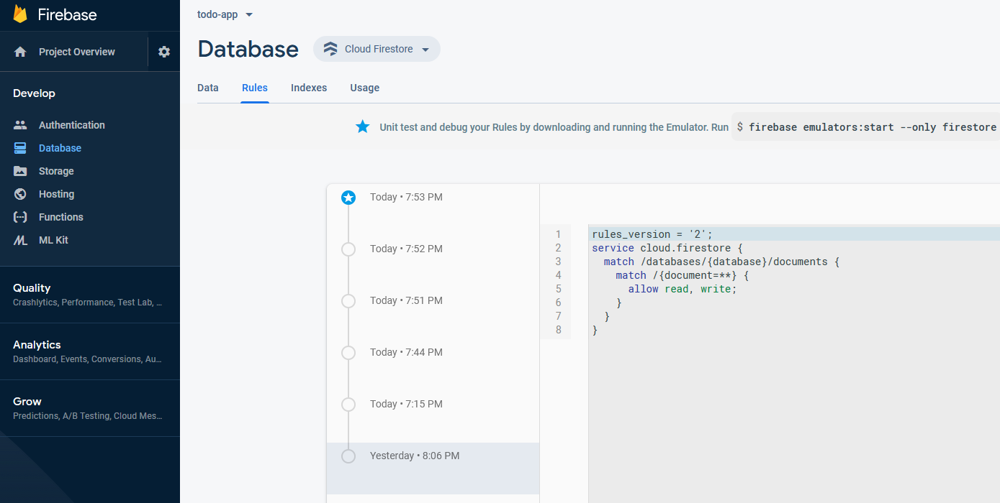
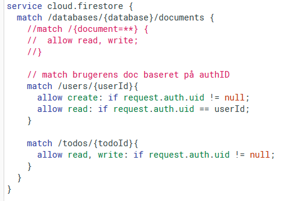
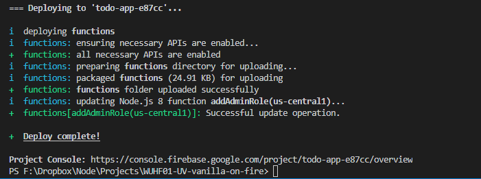

# Firebase Authentication

Et af formålene med authentication, er at bestemme hvilke brugere der har adgang til at hente, ændre, indsætte eller slette bestemte data.

Måske skal alle have læse rettigheder til noget data, mens andet data kun må kunne tilgåes hvis man er logget ind, og måske skal man kun have lov til at oprette et document hvis man har en særlig rettighed.

Der er mange scenarier, og mange metoder og tilgange til authentication. Vi kommer igennem nogle ret grundlæggende funktioner.

## Aktiver Autentication

Det første der skal ske, er at Authentication aktiveres på projektet.

Det sker via firebase consollen.


Derefter skal vi beslutte hvilke metoder det skal være muligt at benytte, for at kunne logge på systemet.
Vi fokuserer udelukkene på **email and password** ind til videre.



## Opret en bruger

Når Authentication er sat til, kan vi manuelt oprette brugere som skal kunne logge på systemet.

Det er ganske enkelt at klikke på **Add user** og udfylde **email** og **password**

Kodeordet vil blive hashet, så det ikke kan læses efterfølgende, så husk hvad du skriver!.

## Knyt Auth til siden

For at få adgang til Authentication på ude i browseren, skal vi hente et nyt firebase modul, som indsættes i `<head>` efter **firebase-app.js** scriptet.

```html
<script src="https://www.gstatic.com/firebasejs/7.2.2/firebase-auth.js"></script>
```

Derudover skal vi have initialiseret auth funktionerne, det sker i det script-tag hvor firebase config og firestore køres i `index.html` dokumentet, her tilføjes auth kodeblokken:

```javascript
// Initialize Firebase
firebase.initializeApp(firebaseConfig);

// referer til authentication service
const auth = firebase.auth();
```

Og da vi kommer til at arbejde med en del forskellige authentication funktioner,giver det mening at oprette en seperat script fil til dem, så opret en fil kaldet **auth.js** og tilføj den til din `index.html`.

`auth.js` skal bare være tom indtil videre.

## Login på siden

Nu hvor der er en bruger på systemet, så skal den bruger kunne logge ind på siden via en login formular.

Så opret en formular med et **brugernavn** og et **kodeord**, samt en button så formen kan sendes.

I `auth.js` filen, knyttes en eventlistner til submit på loginformen, så vi kan gribe data og sende til Authentication.

```javascript
const loginform = document.querySelector("#loginform");
loginform.addEventListener("submit", function(event) {
  event.preventDefault();

  document.querySelector("#loginform_error").textContent = "";

  const email = loginform.username.value;
  const password = loginform.password.value;

  // HUSK VALIDERING !!!

  auth.signInWithEmailAndPassword(email, password)
    .then(function(cred) {
      console.log(cred);
      loginform.reset(); // ryd loginformen
    })
    .catch(function(error) {
      document.querySelector("#loginform_error").textContent = error.message;
    });
});
```

I det viste eksempel kalder vi auth funktionen `signInWithEmailAndPassword` som ganske enkelt kigger i Authentication brugerene efter en bruger med de medsendte oplysninger.

`Catch` funktionen kan benyttes til at udskrive beskeder som serveren sender tilbage, så opret et sted ved din form, hvor det kan udskrives.

Prøv at taste noget forkert, og afprøv hvad der sker hvis f.eks. password ikke er sendt med, eller emailen ikke er en valid email.

Tjek konsollen når det lykkes at logge på med korrekte oplysninger... der får du en masse oplysninger om brugeren.

## Begræns dataadgang

Nu hvor vi har en bruger der kan logge på, så kan vi sætte nogle regler for hvilken data der er tilgængelig.

Det sker på firebase konsollen, under database menuen, og under fanen **Rules**.



Her kan vi bestemme at **todos** collection kun må indlæses hvis man er logget på.


Hvis du allerede er logget på, vil du ikke kunne se hvad reglen gør, så det næste er at oprette en funktion til at logge af.

## Log af systemet

Indsæt en button på siden, og knyt en eventlistener til den i `auth.js` filen.

```javascript
const logout_button = document.querySelector("#logout_button");
logout_button.addEventListener("click", function() {
  auth.signOut().then(function() {
    console.log("brugeren er logget af");
  });
});
```

Efter at have klikket på logud knappen, burde der komme fejl i konsollen i stil med _Missing or insufficient permissions._

Prøv at logge på igen, og se at den fejlbesked forsvinder.

## Opret en bruger

Nu hvor det er muligt at logge af og på, så kunne det være interesant at man kan oprette en bruger igennem hjemmesiden, frem for det kun er igennem Authentication panelet man kan det.

Så opret formular til oprettelse, der indeholder et **email** felt og et **kodeord** felt, det vil også være rigtig god stil at inkludere et **gentag kodeord**. Der skal selvfølgelig være en knap til at skyde formen afsted.

Bind en eventlistener til submit eventen på signup formen i `auth.js` filen, og skriv noget kode der minder om dette:

```javascript
signupform.addEventListener("submit", function(event) {
  event.preventDefault();

  document.querySelector("#signinform_error").textContent = "";

  const email = signupform.username.value;
  const password = signupform.password.value;

  // HUSK VALIDERING, og der burde nok være et "GENTAG PASSWORD" felt!

  auth.createUserWithEmailAndPassword(email, password)
    .then(function(cred) {
      console.log(cred);
      signupform.reset();
    })
    .catch(function(error) {
      document.querySelector("#signinform_error").textContent = error.message;
    });
});
```

Her benyttes funktionen `createUserWithEmailAndPassword` som opretter brugeren på Firebase Authentication servicen.

Det elegante ved den funktion, er at brugeren logges på med det samme, efter det er lykkedes at oprette brugeren.

## Lyt på auth.onAuthStateChanged()

Ligesom vi kan lytte efter hvornår en collection opdateres, så kan vi også lytte efter hvornår en bruger logger af eller på.

Det kræver lige vi flytter `onSnapshot()` funktionen ud af `scripts.js` og indsætter den i den `auth.onAuthStateChanged()` funktion som skal tilføjes til `auth.js` filen. Ellers vil data udskrives dobbelt.

```javascript
auth.onAuthStateChanged(function(user) {
  if (user != null) {
    db.collection("todos").onSnapshot(
      function(snapshot) {
        let changes = snapshot.docChanges();
        changes.forEach(function(change) {
          if (change.type == "added") {
            renderTodo(change.doc);
          } else if (change.type == "removed") {
            let li = todos.querySelector(`li[data-id="${change.doc.id}"]`);
            todos.removeChild(li);
          }
        });
      },
      function(error) {
        console.log(error.message);
      }
    );

    // vis alle elementer der skal være tilgængelige efter login
    // skjul alle elementer der ikke er relevante for en bruger
  } else {
    // fjern alle elementer i TODO listen
    // skjul elementer der kræver man er logget på
  }
});
```

Læg mærke til at `onSnapshot()` funktionen har nu 2 callbacks, den første kaldes når det er en succes, og den anden kaldes hvis det fejler. På den måde kan vi gribe _Missing or insufficient permissions._ fejlen og istedet for en error i konsol, kan vi blot udskrive en tekst.

Da funktionen kører asynkront, er det faktisk ikke nødvendigt at flytte referencen til `#todos` ind i `auth.js`, fordi den konstant vil eksistere på det tidspunkt auth er færdig med at se på brugeren.

## Vis eller skjul data, baseret på login

På nuværende tidspunkt vises alle elementer på skærmen, uanset om man er logget på eller ej.

Det vil give mening at skjule todo-listen og todo-opret-formen hvis man ikke er logget på.

Todo listen bør tømmes helt for elementer, det er ikke nok at sætte en `display:none` på den. Men formularer og logud knappen kan godt vises/skjules via display egenskaben.


## Knyt ydeligere info til en bruger

Nogle gange vil man gerne have flere data knyttet til en brugerprofil, end de begrænsede informationer Authentication tillader.

Til det kan vi oprette endnu en collection i databasen, som kan bindes sammen med Authentication og den unikke id hver bruger får tildelt.

Det kræver en lille tilpasning af `createUserWithEmailAndPassword()` funktionen. Samt at formularen til oprettelse har et inputfelt til at angive brugerens fulde navn.

Collections og Documents er super fleksible, det er faktisk muligit at oprette dem direkte igennem koden, så vi behøver ikke at åbne firebase konsollen og oprette en collection til den ekstra bruger data.

I eksemlet her under kaldes `db.collection('users')` som ikke eksisterer på nuværende tidspunkt, men det vil firestore helt automatisk oprette for os.

Derudover forsøger vi at tilgå et dokument med den unikke id authentication har oprettet, det dokument findes heller ikke, men vil blive oprettet.

Vi sætter en værdi i den dokument den lige har oprettet, nemlig værdien `fullname`, og på den måde har vi nu oprettet både en collection, et document og sat en værdi. 


```javascript
 auth.createUserWithEmailAndPassword(email, password)
   .then(function (cred) {
      console.log(cred);
      // tilføj en return handling, som giver os muligheden for at "chaine" .then()
      return db.collection('users').doc(cred.user.uid).set({
         fullname: signupform.fullname.value
      })
   })
   .then(function () {
      signupform.reset();
   })
   .catch(function (error) {
      document.querySelector('#signinform_error').textContent = error.message;
   });

```


Det dokument der oprettes, vil have den samme id som Authentication brugerne har, og med det grundlag kan vi opsætte en regel for databasen, om at det kun er den specifikke bruger som har rettigheder til det dokument der er knyttet til brugeren.



Man får kun lov at oprette et dokument, hvis `request.auth.uid != null` og man får kun lov til at læse hvis `request.auth.uid == userId` dvs hvis det document der forsøges læst har den samme id som authentication id.
Da der ikke er nogen write regel, får man ikke lov til at ændre på et document, men det kan tilføjes i stil med read reglen.

## Tilgå de ekstra værdier knyttet til brugeren.

Eftersom de ekstra info ikke er knyttet direkte til Authentication objektet, så er vi nødt til at foretage et enkelt kald til det document som er knyttet til brugeren.

Det skal ske i `auth.onAuthStateChanged()` funktionen, der hvor vi har konstateret at brugeren er logget på (samme sted som der hvor vi har flyttet `onSnapshot`).

```javascript
db.collection('users').doc(user.uid).get().then(function (doc) {
   // hvis der er et dokument, udskrives det, indsæt det i et html element
   if (doc) {
      console.log(doc.data().fullname);
   }
});
```

Nu har du sikkert nogle brugere i databasen som ikke har et fullname knyttet til brugerkontoen, så det kan være en ide at slette brugere fra Authentication og oprette dem igen, så du har al data. Eller du kan kopiere den unikke id fra Authentication siden, og benttye den til at manuelt indsætte documents med fullname i users collectionen.


## Administratorer eller almindelige brugere

Det vil være meget fristende at gemme info om en brugers rolle, i users collectionen, og derefter benytte den til at vise/skjule formularer og funktioner på hjemmesiden. Det er også en fin mulighed, men det forhinder ikke adgang til databasen.

Der skal køres noget kode på serversiden for at binde Authentication brugeren sammen med det document der er oprettet til brugeren, og det er ikke bare lige til.

Men istedet har firebase muligheden for at køre noget kaldet **Custom claims** som er værdier der kan bindes på f.eks. en Authentication user, og som vil være tilgængelig via en Token på serversiden, og derved vil være muligt at benytte som et parameter i en regel.

For at kunne opsætte **Custom claims** skal vi have installeret et npm modul kaldet `firebase-tools`, det sker via `npm install firebase-tools -g` *(husk sudo hvis du er på en mac eller linux)*

Når firebase tools er færdiginstalleret, skal der gives adgang til din firebase konto. der klares ved at køre kommandoen: `firebase login` Første gang skal man tillade firebase CLI får adgang til din google konto.

Efter login skal firebase initialiseres: `firebase init functions`.
Her vil man komme igennem en guide med flere spørgsmål.

* vælg Javascript (eller typescript hvis du har helt styr på ts).
* beslut dig for om du vil aktivere ESLint 
* installer node modules

## Opret en firebase server function

I din projektmappe er der nu oprettet en ny mappe kaldet `functions` som indeholder en `index.js` fil.

I den fil kan vi skrive Node kode, som kan udgives på firebase-functions og kaldes fra browseren. På den måde kan vi bede serveren om at udføre særlige handlinger som er sikret og kører i et beskyttet miljø.

Vi ønsker at oprette en funktion der henter en bruger fra Authentication baseret på en email (kunne selvfølgelig også være uid, men email er nemmere at huske).
Når vu har fundet brugeren, ønsker vi at sætte et **custom claim** på den bruger. Det er bare en fancy måde at sige vi ønsker at knytte en bestemt egenskab til brugen. I dette tilfælde, vil vi sætte brugeren til *admin*.

Den færdige kode ser i filen `functions/index.js` sådan her ud, med masser af kommenterer: 
```javascript
const functions = require('firebase-functions');

const admin = require('firebase-admin');
admin.initializeApp();

exports.addAdminRole = functions.https.onCall((data, context) => {
   // find en bruger baseret på den email vi sender med til funktionen
   // .getUserByEmail kan kun kaldes hvis requesten er en valid authenticated requst
   return admin.auth().getUserByEmail(data.email).then(user => {
      // når brugeren er fundet, sikres det at requesten er authenticated
      // og derefter kaldes .setCustomUserClaims()
      // vi giver den en user.uid og derefter sender et objekt med de værdier vi ønsker at sætte
      // her er værdien ganske enkelt "admin:true"
      return admin.auth().setCustomUserClaims(user.uid, {
         admin: true
      })
   }).then(() => {
      // når setCustomUserClaim er succesful, retureres en besked om at det lykekdes
      return {
         message: `Success ${data.email} has been made an Admin`
      }
   }).catch(err => {
      // hvis noget fejler undervejs returneres fejlbeskeden
      return err;
   })
});
```

Når den er skrevet, skal vi sende funktionen til firebase serveren, det gøres ved ar køre kommandoen `firebase deploy --only functions`

Så vil node forsøge at deploy funktionen til firebase, og forhåbentligt ende ud med et resultat i stil emd dette: 


